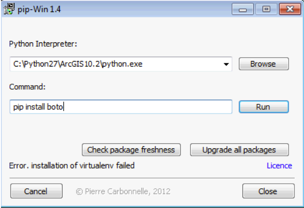

<h1>
<a name="gp-tools-for-aws" class="anchor" href="#gp-tools-for-aws"></a>gp-tools-for-aws</h1>

<h2>
<a name="instructions" class="anchor" href="#instructions"></a>Instructions</h2>

The following steps describe the setup and configuration needed. It only needs to be done once, and then you’re ready to use the GIS Hadoop on EMR GP Tools anytime you want.

1. Installing boto

boto is the python package that is used to communicate with Amazon Web Services. It should be added first before the GP tools are used. This can easily be done using:
> pip install boto

For windows users to easily leverage pip for adding a python package, win-pip can be useful. You can download it from this link:
https://sites.google.com/site/pydatalog/python/pip-for-windows

Once win-pip is downloaded, it will need to be pointed to the Python interpreter used by ArcGIS Desktop. The default install location added by the ArcGIS install is C:\Python27\<ArcGIS version>\python.exe
If you have several directories under Python27, make sure to use the 32 bit directory, not the 64 bit. Also, make sure to use the directory that has the right version of Desktop that you’re using.

Win-pip will add the pip module if it’s not already there.

To add boto, type: pip install boto, then click Run.

 

2. Adding the GIS Hadoop on EMR GP Tools

Download the zip file, and unzip it under a location on your disk. Add this folder as a new folder connection in your Catalog from ArcGIS Desktop. 

That’s it!

You’re now ready to use the GIS Hadoop on EMR GP Tools.

3. Getting your Credentials ready to access your AWS account

You will need to get the following parameters from your AWS account ready before using the tools.

A. To be able to execute the tools you will need an AWS account. Make sure you have your account credentials ready to add into the tools.

You can get your credentials by going to:

http://docs.aws.amazon.com/general/latest/gr/getting-aws-sec-creds.html
you will find it under Access keys (access key ID and secret access key)

B. Also, you will need a key-pair. This is a certificate to encrypt your account information when you try to access your instances over the Internet. 

You can get a key-pair created and downloaded through the following steps:

http://docs.aws.amazon.com/general/latest/gr/getting-aws-sec-creds.html
you will find it under Key Pairs

4. How to access your instances from windows using SSH

In case you need to access your cluster, you can SSH to the master node of the cluster using the following steps.
This can be done using PuttyGen and Putty.

http://docs.aws.amazon.com/AWSEC2/latest/UserGuide/ec2-connect-to-instance-linux.html#using-putty

<h2>
<a name="licensing" class="anchor" href="#licensing"></a>Licensing</h2>

Copyright 2013 Esri

Licensed under the Apache License, Version 2.0 (the "License");
you may not use this file except in compliance with the License.
You may obtain a copy of the License at:

<a href="http://www.apache.org/licenses/LICENSE-2.0">http://www.apache.org/licenses/LICENSE-2.0</a>

Unless required by applicable law or agreed to in writing, software
distributed under the License is distributed on an "AS IS" BASIS,
WITHOUT WARRANTIES OR CONDITIONS OF ANY KIND, either express or implied.
See the License for the specific language governing permissions and
limitations under the License.

A copy of the license is available in the repository's 
<a href="https://raw.github.com/Esri/gis-tools-for-hadoop/master/license.txt">license.txt</a> file.
