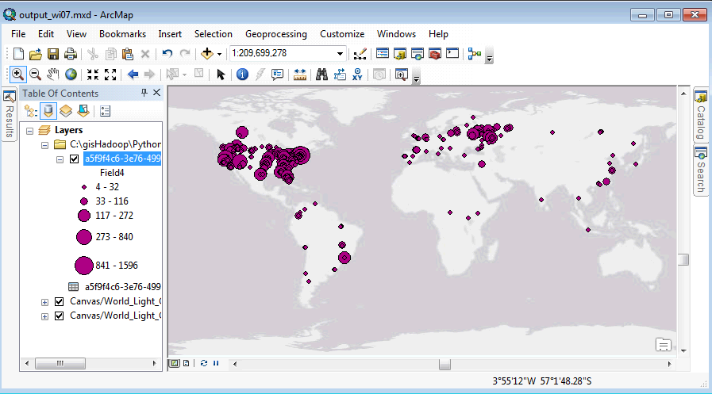

# GP tools for AWS Sample 1

This sample uses AWS EMR to generate a map based on web log analysis results. The analysis shows which geographic locations are getting the most demand.

The log data samples included in this example are extracted from [ArcGIS Online](http://www.arcgis.com/features/) logs, for simplicity they have been cleaned and formated in a csv file. Hadoop is recommended for analysis of very large log files, and to get optimal performance it's recommended that you partition your data. The sample includes, the directory strucutre for data, and the script includes the hive command to apply partitioning.  

Results generated by the hive script are visualized in [ArcGIS Desktop](http://www.esri.com/software/arcgis/arcgis-for-desktop) to generate the map. Here's an example of a map visualized in ArcGIS Desktop after getting the results from EMR.

 

## Instructions

* Download the sample 

* Upload the data sample to a known location in your S3, follow the same exact directory structure and directory naming (for example dt=0).

* Update the hive script to point to where your data is in S3, then upload it to S3 as well. You will find a place holder in the script for this needed value "s3://< S3 path to your data directory here >". Make sure to point to the root directory of your data, that is the data directory right above "dt=0" and the similar data directories. If you follow the data strcuture offered in the sample, that is the directory named data.

* Execute the hive script using the Run Hive Query tool. Point to a new directory in S3 for output, make sure the directory where you will write the output doesn't already exist. 

* After the query finishes, check the output location to download your results. The result should include 1331 records, here's a sample of what the first five records look like:
 
2797,2134,4884,4,3857318.194157999,9595598.783342002

3939,2389,4788,8,3387689.092397999,8348146.481792001

8470,2391,4786,8,3377905.152777996,8338362.542172002

9259,2391,4787,4,3382797.1225879975,8338362.542172002

2368,2438,5224,44,5520587.929557998,8108439.961102001	 

* Add this data as a layer in ArcGIS Desktop. Right click on the layer and choose Display XY Data. Set the last two fields for your X and Y, these are the fields that represent the points for visualization. Also click edit the coordinate system, search for "web mercator", and choose that as the data proejction. 

* After your result is added to the map, you can add a base map to give it context.

* Also, for better visualiztion, right click on the layer you added with your data, choose properties and select the symbology tab. You have many choices for symbolgy options, to get the same one in the map above, select Quantities: Graduated Symbols, then select Field 4 (The Tile count field, which represents how many hits this location is getting) for values.

## Requirements

* Setup GP Tools for AWS first

## Issues

Find a bug or want to request a new feature?  Please let us know by submitting an issue.

## Contributing

Esri welcomes contributions from anyone and everyone. Please see our [guidelines for contributing](https://github.com/esri/contributing).

